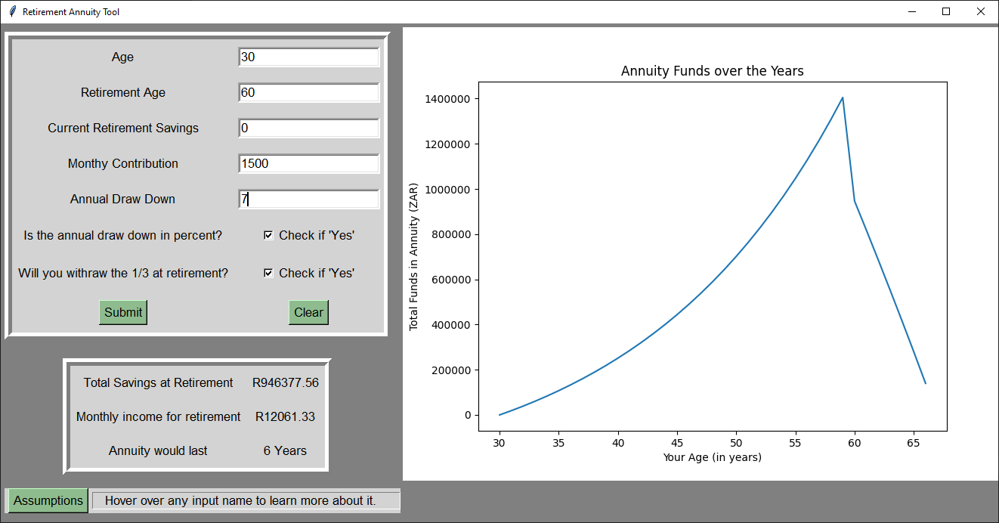
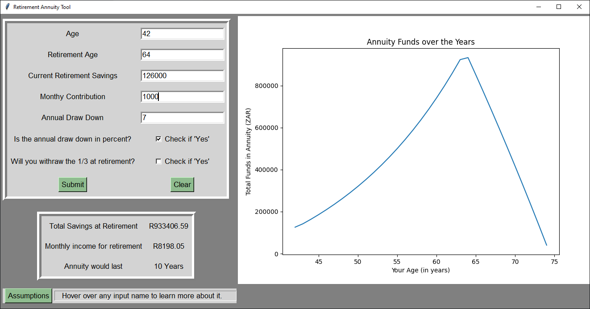
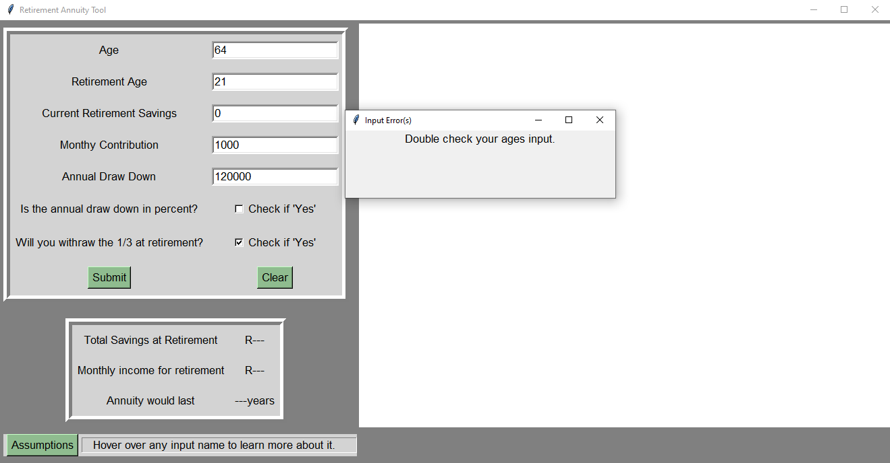

## Basic Annuity Calculator
A basic annuity calculator that has some pessimistic assumptions (i.e. constant increasing inflation). Good for a high-level demonstration of how one works, not to good for actually planning your finances. Provides a basic view of what such fund can look like as you invest up to, and then beyond, retirement age.

## Developed with:
The program is made with Python (specifically 3.10.2) usinf the Tkinter and Matplotlib modules.

## Screenshots

